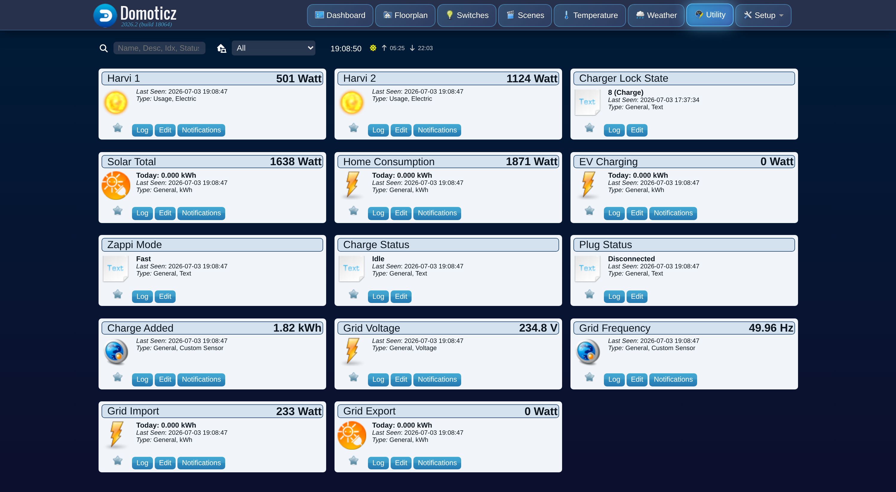

# Monitoring devices

These devices are created automatically on the plugin's first successful poll and need no
manual setup. They are always present, regardless of the **Allow Control** setting. For the
separate, opt-in charger control devices, see [Charger control](control.md).

## Fixed devices (units 1-11)

| Unit | Device name | Domoticz type | What it shows |
|---|---|---|---|
| 1 | Solar Total | kWh (Return) | Total solar generation across all inverters on the hub, as instantaneous power plus a cumulative energy counter. |
| 2 | Grid Import | kWh | Power drawn from the grid, plus a cumulative energy counter. |
| 3 | Grid Export | kWh (Return) | Power fed back to the grid, plus a cumulative energy counter. |
| 4 | Home Consumption | kWh | Derived power used by the rest of the house: generation + grid import − grid export − EV charging. See [How it works](internals.md). |
| 5 | EV Charging | kWh | Power delivered to the vehicle, plus a cumulative energy counter. |
| 6 | Charge Added | Custom (kWh) | Energy added to the vehicle in the current charging session. |
| 7 | Zappi Mode | Text | Current operating mode: Fast, Eco, Eco+, or Stop. |
| 8 | Charge Status | Text | Current charge state: Idle, Paused, Diverting, Boosting, or Complete. |
| 9 | Plug Status | Text | Current plug/connection state: Disconnected, Connected, Charging, or Fault. |
| 10 | Grid Voltage | Voltage (V) | Grid/mains voltage. |
| 11 | Grid Frequency | Custom (Hz) | Grid/mains frequency. |

Solar Total, Home Consumption, EV Charging, Grid Import, and Grid Export all carry both a live
power reading and a real cumulative kWh counter, built from myenergi's own per-minute energy
history so it matches the totals shown in the myenergi app. See
[How it works](internals.md#cumulative-kwh-counters) for how the counters are built and why they
survive a Domoticz restart.

!!! note "Solar Total and Grid Export use the Domoticz \"Return\" type"
    This is cosmetic: it changes the device icon and the Type label in the Utility list, but it
    does not feed Domoticz's Energy Dashboard, which only recognizes an official P1 smart meter
    for generation/usage splitting. If you delete Solar Total or Grid Export, the plugin
    recreates them with the Return type set automatically.

## Per-harvi devices (unit 20 and up)

Every harvi (a small CT-clamp sensor that measures power on a circuit or inverter) on the hub
gets its own live-power device, starting at unit 20 and counting up as new harvis are
discovered. A harvi only ever sends myenergi its power reading at that moment, not a running
energy total, so these devices are **watts-only**: there is no kWh counter for a harvi.

The device type depends on what the harvi is clamped to:

- A harvi with at least one CT measuring **generation** (solar) becomes a **Usage (W)** device
  with the built-in sun icon. Its value never shows below zero.
- Any other harvi (a load, a battery, grid) becomes a **signed Custom (W)** device, so a
  battery's charge and discharge (positive and negative) render correctly.

### Naming a harvi

By default each harvi device is named `Harvi <serial>`. There are two ways to give it a more
useful name:

1. **Rename the device in Domoticz.** Match it to the right inverter or circuit by its live
   watts, then rename it as you would any other device. The plugin never overwrites a name you
   have set this way.
2. **Use the Harvi Names settings.** Copy the harvi's serial number from its default device name
   into one of the four `Harvi N serial` fields in the hardware settings, and type the friendly
   name into the matching `Harvi N name` field. This is useful if you want the name to survive
   deleting and recreating the device, since a Domoticz rename does not.

A harvi with no matching name slot, and no manual rename, keeps its default `Harvi <serial>`
name.

!!! note "Per-harvi power and Solar Total may not add up exactly"
    Each harvi reports to the hub wirelessly on its own cadence, independently of the zappi's own
    generation reading. At any single instant the sum of the per-harvi power devices may not
    exactly match Solar Total. This is normal timing behavior, not a plugin error; the cumulative
    counters converge over time.

## See also

- [Charger control](control.md) for the opt-in units 12-18.
- [How it works](internals.md) for how power and energy values are calculated.
